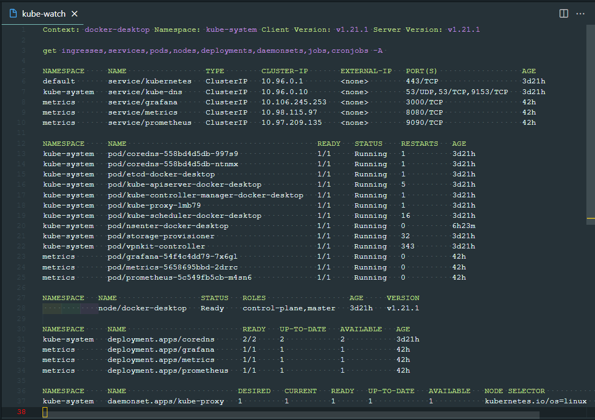

# vscode-vscode-kubewatch

Kubernetes Watch

## How to use ?

In command palette type ```Kubernetes Watch: Show``` to show the Kubernetes Watch.



# Configuration

- Specified [Resources types](https://kubernetes.io/docs/reference/kubectl/overview/#resource-types) to show from namespace:
  - current
  - specific or
  - all namespaces
- [Format](https://kubernetes.io/docs/reference/kubectl/overview/#formatting-output)
- Auto refresh interval in seconds (0 disables auto refresh)

### Keybindings

|Keybinding|Command|
|---|---|
|```c```|Edit Kube Config|
|```n```|Copy name|
|```q```|Quit|
|```F5```|Reload|
|```w```|Switch namespace|
|```CTRL+,```|Show settings for this extension|
